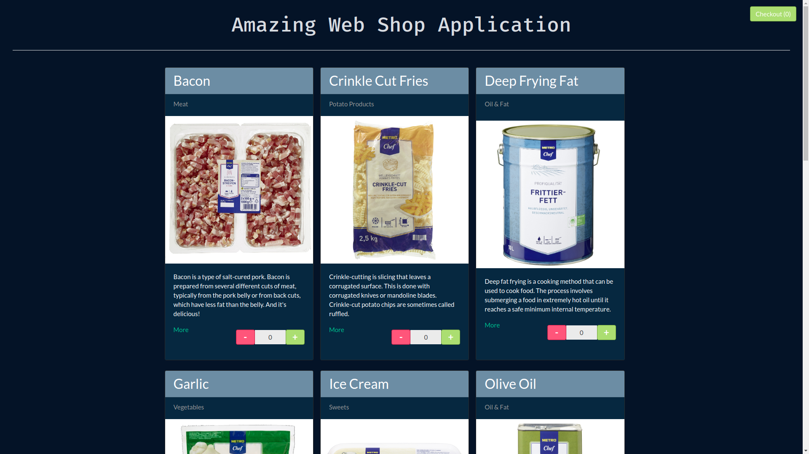

# Webshop App in CLJS

This webshop app is built with [ClojureScript](https://clojurescript.org/) on [Reagent] and compiled with
[Figwheel](https://github.com/bhauman/lein-figwheel). It's also an alternative frontend for my 
[Clojure Webshop App](https://github.com/tbsschroeder/clojure-webshop-app).

## Requirements

Short and crisp: Always have [Docker](https://docs.docker.com/install/) installed.

## Setup

First, the app needs the database from former project [Clojure Webshop App](https://github.com/tbsschroeder/clojure-webshop-app).
In their just hit

    docker-compose up

Then you can start the system:

    lein run

To get an interactive development environment run:

    npm install
    lein figwheel

and open your browser at [localhost:3449](http://localhost:3449/).
This will auto compile and send all changes to the browser without the
need to reload. After the compilation process is complete, you will
get a Browser Connected REPL. An easy way to try it is:

    (js/alert "Am I connected?")

and you should see an alert in the browser window.

To clean all compiled files:

    lein clean

To create a production build run:

    lein do clean, cljsbuild once min

And open your browser in `resources/public/index.html`. You will not
get live reloading, nor a REPL. 

### Helper

You can run multiple helping tools like code formatting, linting, interactive
dependency checker and code analyzer via:

    lein cljfmt fix
    lein eastwood
    lein ancient upgrade :interactive :check-clojure
    lein kibit

## Demo

## License
___
*All images are under the copyright of [METRO AG](https://www.metroag.de/).*
___

The MIT License (MIT)

*Copyright © 2021 Dr. Tobias Schröder*

Permission is hereby granted, free of charge, to any person obtaining a copy of
this software and associated documentation files (the "Software"), to deal in
the Software without restriction, including without limitation the rights to
use, copy, modify, merge, publish, distribute, sublicense, and/or sell copies of
the Software, and to permit persons to whom the Software is furnished to do so,
subject to the following conditions:

The above copyright notice and this permission notice shall be included in all
copies or substantial portions of the Software.

THE SOFTWARE IS PROVIDED "AS IS", WITHOUT WARRANTY OF ANY KIND, EXPRESS OR
IMPLIED, INCLUDING BUT NOT LIMITED TO THE WARRANTIES OF MERCHANTABILITY, FITNESS
FOR A PARTICULAR PURPOSE AND NON INFRINGEMENT. IN NO EVENT SHALL THE AUTHORS OR
COPYRIGHT HOLDERS BE LIABLE FOR ANY CLAIM, DAMAGES OR OTHER LIABILITY, WHETHER
IN AN ACTION OF CONTRACT, TORT OR OTHERWISE, ARISING FROM, OUT OF OR IN
CONNECTION WITH THE SOFTWARE OR THE USE OR OTHER DEALINGS IN THE SOFTWARE.
